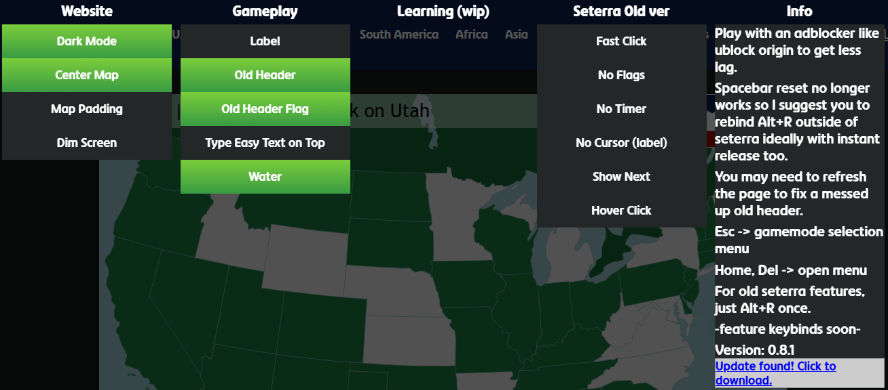

# seterra-qol-extension
<p>Quality of life extension for seterra geoguessr version AND seterra webarchive version.</p>
<p>Works on chrome and firefox.</p>



## Installation
Chrome:
  1. Download the release zip
  2. Extract it TO a folder. So that you have a folder with the extension files in it.
  3. Extensions -> developer mode ON -> load unpacked

Firefox:
  1. Download the release zip
  2. Firefox settings -> Extensions and themes -> cog wheel -> install addon from file

## Building
  1. Requirements: Rust + Cargo, wasm-pack, wasm32-unknown-unknown Rust target.
  2. Setup: Install Rust from rustup, then: 'cargo install wasm-pack', 'rustup target add wasm32-unknown-unknown'
  3. The build.bat runs:
  ```shell
  wasm-pack build --target web --out-dir seterra-wasm-extension/pkg
  ```
  4. You can then load the folder as an unpacked extension in chromium or in firefox's about:debugging
